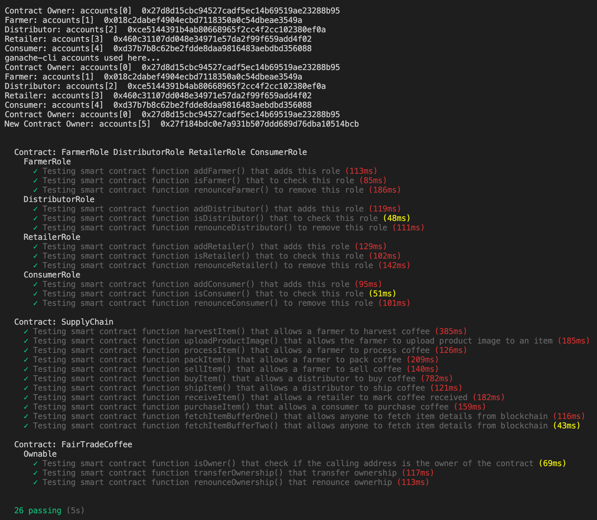

# Write Up

## Project write-up - UML

### Activity


### Sequence

    
### State


### Classes (Data Model)


## Project write-up - Libraries
* dotenv: To store secrets and api keys
* express, express-fileupload: To upload product image
* ipfs-http-client: To upload file to IPFS via Infura
* truffle-hdwallet-provider: To use Ethereum public networks

## Project write-up - IPFS
* IPFS is used as the file storage.
* When "Upload" button is clicked, DApp uploads the image via Infura and IPFS return a hash. Then the hash is also stored in the block as `productImage`.
* When "Read" button is clicked, DApp uses the hash to retreive the image from IPFS.

## General Write Up
## Getting Started

These instructions will get you a copy of the project up and running on your local machine for development and testing purposes. See deployment for notes on how to deploy the project on a live system.

### Prerequisites

Please make sure you've already installed ganache-cli, Truffle and enabled MetaMask extension in your browser.

### Installing

> The  code is written for **Solidity v0.4.24**. To use this code, please run `npm i -g truffle@4.1.14` to install Truffle v4 with Solidity v0.4.24. 

A step by step series of examples that tell you have to get a development env running

Clone this repository:

```
https://github.com/strengthandwill/nd1309-Project-6b.git
```

Install all requisite npm packages (as listed in ```package.json```):

```
npm install
```

Launch Ganache:

```
ganache-cli -m "spirit supply whale amount human item harsh scare congress discover talent hamster"
```

In a separate terminal window, Compile smart contracts:

```
truffle compile
```

This will create the smart contract artifacts in folder ```build\contracts```.

Migrate smart contracts to the locally running blockchain, ganache-cli:

```
truffle migrate
```

Test smart contracts:

```
truffle test
```

All 26 tests should pass.



In a separate terminal window, launch the Front End:

```
npm run dev
```

### Running the Front End

#### Add Access Control
* Goto Access Control section. 
* Add Farmer ID and click "Add" to add address to Farmer Role.
* Add Distributor ID and click "Add" to address to Distributor Role.
* Add Retailer ID and click "Add" to address to Retailer Role.
* Add Consumer ID and click "Add" to address to Consumer Role.

#### Supply Chain Workflow
* Goto Product Overview section.
* Login as Farmer, add in Product Overview, Farm Details and Product Details and click "Harvest" to mark an item "Harvested".
* Login as Farmer, click "Process" to mark an item "Processed".
* Login as Farmer, click "Pack" to mark an item "Packed".
* Login as Farmer, click "ForSale" to mark an item "ForSale".
* Login as Distributor, click "Buy" to mark an item "Sold".
* Login as Distributor, click "Ship" to mark an item "Shipped".
* Login as Retailer, click "Receive" to mark an item "Received".
* Login as Consumer, click "Purchase" to mark an item "Purchase".

#### Upload Product Image
* Goto Product Image section.
* Login as Farmer, upload image and click "Upload" to upload image to IPFS.
* Login as Farmer, click "Read" to read file from IPFS using the hash.

#### Renounce Access Control
* Goto Access Control section. 
* Add Farmer ID and click "Renounce" to remove address to Farmer Role.
* Add Distributor ID and click "Renounce" to remove to Distributor Role.
* Add Retailer ID and click "Renounce" to remove to Retailer Role.
* Add Consumer ID and click "Renounce" to remove to Consumer Role.

#### Transfer Ownership
* Login as Owner, add in new contract owner and click "Transfer" to transfer ownership to new contract owner.
* Login as Owner, click "Renounce" to remove the contract owner.

# Write smart contracts with functions
Refer to the source code

# Test smart contract code coverage


# Deploy smart contract on a public test network (Rinkeby)

## Contract Creation
* FarmerRole: [0x19bfcfdaf429953da7ea06d7d71b0ff7ee076652b1a9463d28a914fc3f0dc0bb](https://rinkeby.etherscan.io/tx/0x19bfcfdaf429953da7ea06d7d71b0ff7ee076652b1a9463d28a914fc3f0dc0bb)
    * Contract: [0xb5f2f90f040c631a9d1ada5d01b6812eb74e4581](https://rinkeby.etherscan.io/address/0xb5f2f90f040c631a9d1ada5d01b6812eb74e4581)
* DistributorRole: [0xe0872a9b26285dd85ee2f5f3d679b17feb102ebde758867c4d11ea69b76cb9ef](https://rinkeby.etherscan.io/tx/0xe0872a9b26285dd85ee2f5f3d679b17feb102ebde758867c4d11ea69b76cb9ef)
    * Contract: [0x634866d0a45cfc89490c1440dce26ce12a4ef178](https://rinkeby.etherscan.io/address/0x634866d0a45cfc89490c1440dce26ce12a4ef178)
* RetailerRole: [0x9419b6aca3ae350b14069266772b31671231f590c94e63117e98541d1834d148](https://rinkeby.etherscan.io/tx/0x9419b6aca3ae350b14069266772b31671231f590c94e63117e98541d1834d148)
    * Contract: [0x8e5fef6cd589d869db631543f34f09e5cd9a4fdb](https://rinkeby.etherscan.io/address/0x8e5fef6cd589d869db631543f34f09e5cd9a4fdb)
* ConsumerRole: [0x6c9b8ca8092e2ea5da7238c617e67c1f22782c5ab4810c9fe9ee683ce54c296c](https://rinkeby.etherscan.io/tx/0x6c9b8ca8092e2ea5da7238c617e67c1f22782c5ab4810c9fe9ee683ce54c296c)
    * Contract: [0x204da974fc69b8a037f847f87aa8b94813011b8c](https://rinkeby.etherscan.io/address/0x204da974fc69b8a037f847f87aa8b94813011b8c)
* SupplyChain: [0x8fc99e7432b5837658ab15775f9c4c7e305617fb1b56352489710549dcd5ef11](https://rinkeby.etherscan.io/tx/0x8fc99e7432b5837658ab15775f9c4c7e305617fb1b56352489710549dcd5ef11)
    * Contract: [0x937fcb6fce57e6039a0fbccf57f59b71df48c623](https://rinkeby.etherscan.io/address/0x937fcb6fce57e6039a0fbccf57f59b71df48c623)
* FairTradeCoffee:  [0xc58d6004b7caa42ef5a4714d6fd53c660f4165d8dec5519c7e37fe09b307c779](https://rinkeby.etherscan.io/tx/0x93c3eceed348b11a87e19bb1d5f07628e869e4dd)
    * Contract: [0x93c3eceed348b11a87e19bb1d5f07628e869e4dd](https://rinkeby.etherscan.io/address/0x93c3eceed348b11a87e19bb1d5f07628e869e4dd)

## Add Roles
* FarmerAdded: [0x4ab8f54503d4d3d10f96af9e350a5b69fc1cd13ba914f26ec386b394cf925716](https://rinkeby.etherscan.io/tx/0x4ab8f54503d4d3d10f96af9e350a5b69fc1cd13ba914f26ec386b394cf925716)
* DistributorAdded: [0x4ff12a7b1c655fc1ec359f828d02b670598f78e4703075276a608da577657ed8](https://rinkeby.etherscan.io/tx/0x4ff12a7b1c655fc1ec359f828d02b670598f78e4703075276a608da577657ed8)
* RetailerAdded: [0x6b79f5695c6274ee7e28c08b81b48462a8d3986571fa1b8f1614d43dcefabe8d](https://rinkeby.etherscan.io/tx/0x6b79f5695c6274ee7e28c08b81b48462a8d3986571fa1b8f1614d43dcefabe8d)
* ConsumerAdded: [0x4c641919842e926ad3b5fb8856f06e0cfed8c024db38cf6b517b627779a3af8c](https://rinkeby.etherscan.io/tx/0x4c641919842e926ad3b5fb8856f06e0cfed8c024db38cf6b517b627779a3af8c)

## Transaction History
* Harvested: [0xb98c2624ebb3c0fa5afc683114fbcf6da0a04ca35af290ff726fa2998f2ed202](https://rinkeby.etherscan.io/tx/0xb98c2624ebb3c0fa5afc683114fbcf6da0a04ca35af290ff726fa2998f2ed202)
* Processed: [0x74487dd8402598332c431cc86ce41dceb07ad9ec4306fcd58523c83a63e9ca49](https://rinkeby.etherscan.io/tx/0x74487dd8402598332c431cc86ce41dceb07ad9ec4306fcd58523c83a63e9ca49)
* Packed: [0xfc4f7339d380614ec91f430c295820a386b57e121babc181e3e2c81f8c55f1c2](https://rinkeby.etherscan.io/tx/0xfc4f7339d380614ec91f430c295820a386b57e121babc181e3e2c81f8c55f1c2)
* ForSale: [0xcf9dbb08082d8db18b4b5af19f9f584452021e6cb0e4351144b8c475420cf094](https://rinkeby.etherscan.io/tx/0xcf9dbb08082d8db18b4b5af19f9f584452021e6cb0e4351144b8c475420cf094)
* Sold: [0x8ca805a36c92fe92eef897f9bb681bbdf260748930b5ab9f159c5da02acfb672](https://rinkeby.etherscan.io/tx/0x8ca805a36c92fe92eef897f9bb681bbdf260748930b5ab9f159c5da02acfb672)
* Shipped: [0xc56b1e2b651b0e02f7cbe526a943595b62fefe822ef6b02fd12260d7898a4257](https://rinkeby.etherscan.io/tx/0xc56b1e2b651b0e02f7cbe526a943595b62fefe822ef6b02fd12260d7898a4257) 
* Received: [0xd9613f29aa8c3cd56a4ff2fd8815da671f3cff8623e5966ea1299d8b662ac58e](https://rinkeby.etherscan.io/tx/0xd9613f29aa8c3cd56a4ff2fd8815da671f3cff8623e5966ea1299d8b662ac58e)
* Purchased: [0xdb3c2f19a4c09d38c87274fbb010677b71a4005f36e684a530a63133d0f8f004](https://rinkeby.etherscan.io/tx/0xdb3c2f19a4c09d38c87274fbb010677b71a4005f36e684a530a63133d0f8f004)
* Uploaded:  [0xac2011e20ab83b00bfce8023c104de0ba72011d4597510e474f24bfa7b1736d4](https://rinkeby.etherscan.io/tx/0xac2011e20ab83b00bfce8023c104de0ba72011d4597510e474f24bfa7b1736d4)
    *   Image: [QmdNqizUYxfoikGeFErtcJKJAJeMDKJ6dLZ5ngcZvxdTYq](https://gateway.ipfs.io/ipfs/QmdNqizUYxfoikGeFErtcJKJAJeMDKJ6dLZ5ngcZvxdTYq)

## Renounce Roles
* FarmerRemoved: [0xcf523d35f796be290d110d3c62e59ba692f7c452854d0f10dd6684717560bce4](https://rinkeby.etherscan.io/tx/0xcf523d35f796be290d110d3c62e59ba692f7c452854d0f10dd6684717560bce4)
* DistributorRemoved: [0xbc3d948e3858a87bfb35666f3bb7791e5b139f3f852629f7b8f82a0a4cc84314]( https://rinkeby.etherscan.io/tx/0xbc3d948e3858a87bfb35666f3bb7791e5b139f3f852629f7b8f82a0a4cc84314)
* RetailerRemoved: [0x4ba32dee3a5c54a6668c7f508f5e61b29727f7c52351f77e7d08d38b44c0336e](https://rinkeby.etherscan.io/tx/0x4ba32dee3a5c54a6668c7f508f5e61b29727f7c52351f77e7d08d38b44c0336e)
* ConsumerRemoved: [0x118fa604ab8f636dfdaea5cb884ce67666db945a547b36addd0986c5d70e56e5](https://rinkeby.etherscan.io/tx/0x118fa604ab8f636dfdaea5cb884ce67666db945a547b36addd0986c5d70e56e5)

## Transfer Ownership
* TransferOwnership: [0xd27586539ba8df9282d4853c68e2df270bee4ff1787853a7df8faec629aeb4ca]( https://rinkeby.etherscan.io/tx/0xd27586539ba8df9282d4853c68e2df270bee4ff1787853a7df8faec629aeb4ca)
* RenounceOwnership: [0x89ed53ba44a53d4e429fd9b5a79a63dfd49dc8eb5c307e25772623ea39432dd8]( https://rinkeby.etherscan.io/tx/0x89ed53ba44a53d4e429fd9b5a79a63dfd49dc8eb5c307e25772623ea39432dd8)

# Modify client code to interact with a smart contract


# Optional: Implement Infura to store product image
